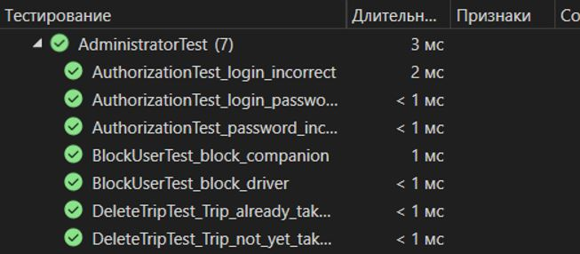

# Курсова Робота

**З курсу:** "Об'єктно-орієнтоване програмування"

**На тему:** "Розроблення програмного забезпечення з використанням об’єктно-орієнтованої парадигми"

## ВСТУП

У сучасному світі все більше людей шукають способи економії часу та коштів на подорожах. Пошук попутників - це один із таких способів. Він дозволяє людям ділитися витратами на бензин, плату за проїзд та інші дорожні збори, а також знайомитися з новими людьми.
Потенційними користувачами додатку для пошуку попутників можуть бути:
- Студенти: їм часто потрібно подорожувати між містами, але вони не завжди можуть дозволити собі купити квиток на автобус чи поїзд;
- Молоді люди: вони шукають нові способи подорожувати та знайомитися з новими людьми;
- Люди, які їздять у відпустку: їм може бути вигідніше поділити витрати на бензин з іншими людьми, які їдуть у тому ж напрямку;
- Водії, які їдуть порожніми: їм може бути вигідно взяти з собою попутників, щоб поділити витрати на бензин.
Серед лідерів серед програмних аналогів можна виділити – BlaBlaCar: це найпопулярніший додаток для пошуку попутників у світі. Він доступний у 22 країнах світу, включаючи Україну.
Для розробки додатку використано C#/.Net Windows Form.

## 1	ФУНКЦІОНАЛЬНІ ВИМОГИ ДО ПРОГРАМНОГО ЗАБЕЗПЕЧЕННЯ

### Mind Map для заданої предметної області

Було виділено три основні гілки:
- Зберігання даних (*.json)
- інтерфейси (Windows Form)
- Ролі (водій, попутник, адміністратор).

### Формулювання функціональних вимог для ролей

***Функціональні вимоги користувача з роллю «Попутник»:***
1. Попутник може зареєструватися

*Примітка:*
- довжина логіну більше 3-х символів;
- довжина паролю більше 6-ти символів;
- номер телефону у форматі +38(XXX)-XXXXXXX;
- довжина імені більше 1-го символу.

2. Попутник може авторизуватися

*Примітка:*
- не можна авторизуватися з невірним логіном і паролем.

3. Попутник може шукати поїздки за критеріями (за маршрутом, за датою, за кількістю вільних місць)

*Примітка:*
- Не можна шукати поїздку, вказавши минулу дату;
- Не можна шукати поїздку, вказавши кількість місць менше 1.

4. Попутник може бронювати місце у поїздці.
5. Попутник може переглянути історію своїх поїздок.
6. Попутник може переглянути свої заплановані поїздки.
7. Попутник може оновити профіль.

*Примітка:*
- Фото в форматі: ".bmp", ".jpg".
- довжина паролю більше 6-ти символів;
- номер телефону у форматі +38(XXX)-XXXXXXX;
- довжина імені більше 1-го символу.

***Функціональні вимоги користувача з роллю «Водій»:***
1. Водій може зареєструватися

*Примітка:* 

- довжина логіну більше 3-х символів;
- довжина паролю більше 6-ти символів;
- номер телефону у форматі +38(XXX)-XXXXXXX;
- довжина імені більше 1-го символу.

2. Водій може авторизуватися.

*Примітка:*
- не можна авторизуватися з невірним логіном і паролем.

3. Водій може додати поїздку, вказати маршрут, дату, кількість вільних місць.

*Примітка:*
- не можна додати поїздку на минулу дату;
- кількість вільних місць більше 0;
- місце відправки більше 0 символів;
- місце призначення більше 0 символів.

4. Водій може переглянути свої заплановані поїздки.
5. Водій може переглянути історію своїх поїздок.
6. Водій може оновити профіль.

*Примітка:*
- Фото в форматі: ".bmp", ".jpg".
- довжина паролю більше 6-ти символів;
- номер телефону у форматі +38(XXX)-XXXXXXX;
- довжина імені більше 1-го символу.

***Функціональні вимоги користувача з роллю «Адміністратор»***
1. Адміністратор може авторизуватись.

*Примітка:* 
- не можна авторизуватися з невірним логіном і паролем.

2. Адміністратор може блокувати інших користувачів.
3. Адміністратор може видаляти поїздки.

## 2	МОДЕЛЮВАННЯ ПРЕДМЕТНОЇ ОБЛАСТІ

### Виділення і опис класів предметної області

***Клас «Driver» – водій***

Клас Driver описує водія, який має: логін, пароль, ім’я, номер телефону та фото. Та може реєструватися, авторизуватися, створювати поїздки, переглядати свою історію поїздок, переглядати заплановані поїздки та редагувати свій профіль.

***Клас «Companion» – попутник***

Клас Companion описує попутника, який має: логін, пароль, ім’я, номер телефону та фото. Та може реєструватися, авторизуватися, шукати поїздки, бронювати місця у поїздці, переглядати свою історію поїздок та редагувати профіль.

***Клас «Administrator» – адміністратор***

Клас Administrator описує адміністратора, що слідкує за додатком, має: логін та пароль. Та може: авторизуватися, блокувати користувачів, видаляти поїздки.

***Клас «Trip» – поїздка***

Клас Trip описує поїздку, має: унікальний номер, водія, список попутників, дату, місце відправки, місце прибуття та кількість місць.

### Встановлення зв’язків між класами

- ‘User’ – абстрактний клас, який описує властивості та методи користувача, які користуються додатком. Від нього спадкуються три класи: ‘Driver’, ‘Companion’ і ‘Administratior’, вони мають спільні базові характеристики (логін, пароль) та методи (Авторизація), реалізуючи всі властивості та методи абстрактного класу.

- Клас ‘Trip’ має асоціативний зв’язок з класом ‘Driver’, тобто об’єкт класу ‘Trip` містить об’єкт класу ‘Driver’. А також агрегаційний зв’язок з класом ‘Driver’, тобто у конструктор ‘Trip’ передається посилання на вже наявний об'єкт класу ‘Driver’.
- Клас ‘Trip’ має композиційний зв’язок з класом ‘Companion’, у конструкторі цього класу буде створюватися список об’єктів типу ‘Companion’.

- ITrip – це інтерфейс, який визначає функціональність поїздки. Він містить властивості (дата, місце призначення, місце відправки, кількість місць, водій) та методи (виведення інформації про поїздку та додавання попутника до списку попутників).

## 3.	ПРОГРАМНА РЕАЛІЗАЦІЯ КЛАСІВ ПРЕДМЕТНОЇ ОБЛАСТІ І ЇХ ТЕСТУВАННЯ

### Структура проекту з реалізацією класів предметної області

### Розроблення unit-тестів для класів предметної області

Код розроблених unit-тестів можна подивитись у гілці *master* в папці *KP_Dykun_TestProject*

### Повна реалізація класів предметної області

Повну реалізацію програмного коду розроблених класів предметної області можна подивитись у гілці *master* в папці *KP_Dykun_Classes*

### Результати unit-тестування класів предметної області

## 4.	ПРОЕКТУВАННЯ І ПРОГРАМНА РЕАЛІЗАЦІЯ КЛАСІВ ІНТЕРФЕЙСУ КОРИСТУВАЧА

### Структура проекту з реалізацією класів інтерфейсу користувача

### Виділення класів для реалізації інтерфейсу користувача

***Клас «AuthorizationForm» – форма авторизації***

Цей клас описує форму авторизації, на якій користувач здійснює вхід в аккаунт.
Характеристики класу «AuthorizationForm»:

| Назва характеристики | Тип значення |
| -------------------- | ------------ |
| Логін користувача | string |
| Пароль користувача | string |
| Попутник | Companion |
| Водій | Driver |
| Адміністратор | Administrator |
| Список адміністраторів | List(Administrator) |
| Список попутників | List(Companion) |
| Список водіїв | List(Driver) |
| Список користувачів | List(User) |

***Клас «RegistrationForm» – форма реєтрації***

Цей клас описує форму реєстрації, на якій користувач створює свій аккаунт. 
Характеристики класу «RegistrationForm»:

| Назва характеристики | Тип значення |
| -------------------- | ------------ |
| Логін користувача | string |
| Пароль користувача | string |
| Ім'я | string |
| Телефон | string |
| Роль | string |
| Водій | Driver |
| Попутник | Companion |
| Список користувачів | List(User) |

***Клас «DriverMainForm» – форма користувача з роллю «Водій»***

Цей клас описує головну форму користувача з роллю «Водій». 
Характеристики класу «DriverMainForm»:

| Назва характеристики | Тип значення |
| -------------------- | ------------ |
| Місце відправки | string |
| Місце прибуття | string |
| Дата поїздки | DateTime |
| Кількість місць | short |
| Водій | Driver |
| Поїздки | List(Trip) |

***Клас «CompanionMainForm» – форма користувача з роллю «Попутник»***

Цей клас описує головну форму користувача з роллю «Попутник».
Характеристики класу «CompanionMainForm»:

| Назва характеристики | Тип значення |
| -------------------- | ------------ |
| Місце відправки | string |
| Місце прибуття | string |
| Дата поїздки | DateTime |
| Кількість необхідних місць | short |
| Попутник | Companion |
| Поїздки | List(Trip) |

***Клас «AdminForm» – форма користувача з роллю «Адміністратор»***

Цей клас описує форму користувача з роллю «Адміністратор». 
Характеристики класу «AdminForm»:

| Назва характеристики | Тип значення |
| -------------------- | ------------ |
| Водії | List(Driver) |
| Попутники | List(Companion) |
| Поїздки | List(Trip) |

***Клас «PlannedTravelsForm» – форма з запланованими поїздками***

Цей клас описує форму, яку отримує користувач з роллю *«Попутник»* або *«Водій»*, коли хоче переглянути свої заплановані поїздки.
Характеристики класу «PlannedTravelsForm»:

| Назва характеристики | Тип значення |
| -------------------- | ------------ |
| Заплановані поїздки | List(Trip) |

***Клас «TravelHistoryForm» – форма з історією поїздок***

Цей клас описує форму з історією поїздок користувачів.
Характеристики класу «TravelHistoryForm»:

| Назва характеристики | Тип значення |
| -------------------- | ------------ |
| Поїздки користувача | List(Trip) |

***Клас «UserProfileForm» – форма з профілем користувача***

Цей клас описує форму, яку отримують користувачі, коли переглядають свій профіль.
Характеристики класу «UserProfileForm»:

| Назва характеристики | Тип значення |
| -------------------- | ------------ |
| Водії | List(Driver) |
| Попутники | List(Companion) |

### Програмна реалізація класів інтерфейсу користувача

Повну реалізацію програмного коду розроблених класів інтерфейсу користувача можна подивитись у гілці *master* в папці *KP_Dykun_UIClasses*

## ВИСНОВКИ
У результаті виконання курсової роботи було розроблено програмне забезпечення з використанням об’єктно-орієнтованої парадигми для предметної області: пошук попутників.
В ході роботи було описано предметну область та функціональні вимоги до ПЗ, виділено три ролі користувачів та їх поведінку, спроектовано діаграму класів, розроблено інтерфейс користувача, проведено функціональне та unit тестування програми.
